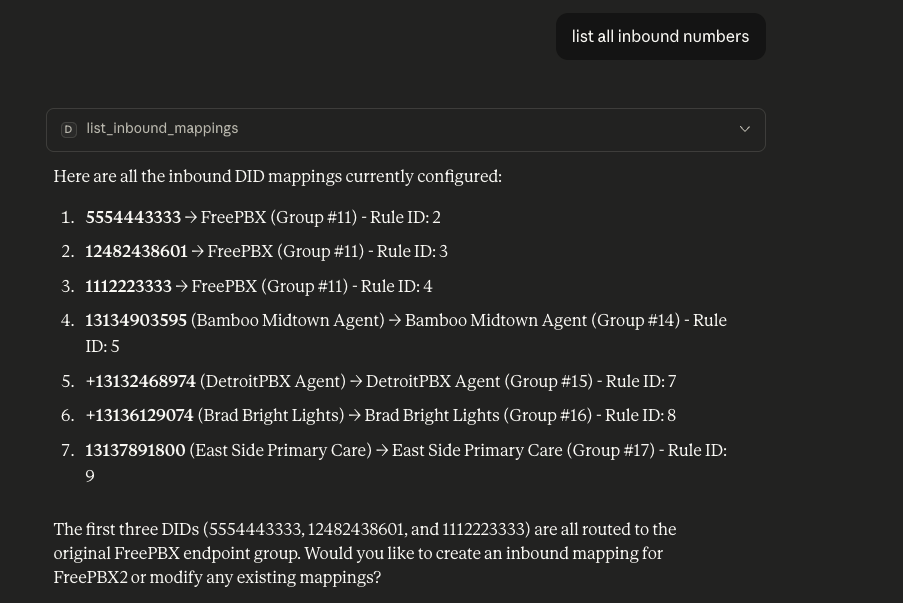

# dSIPRouter MCP Server

This repository contains the dSIPRouter MCP Server, which provides an interface to interact with dSIPRouter from conversational AI chatbots such as Claude and ChatGPT.

## Overview

The MCP (Model Context Protocol) server allows AI assistants to perform various operations on dSIPRouter, including managing endpoint groups, carrier groups, inbound mappings, and retrieving call data.

## Example Questions

Here are some example questions you can ask the AI assistant when using this MCP server:

- List the endpoint groups of dSIPRouter
- List the carrier groups of dSIPRouter
- Create a CSV file with all of the calls that happened yesterday
- List all inbound numbers

        Here's a screenshoot of the result

        

## Setup

### Validate that the MCP Server is Working

1. Install dependencies:
   ```bash
   pip install -r requirements.txt
   ```

2. Set environment variables:
   - `DSIP_BASE_URL`: The base URL of your dSIPRouter instance
   - `DSIP_TOKEN`: Your dSIPRouter API token
   - `DSIP_VERIFY_SSL`: Whether to verify SSL certificates (default: true)

3. Run the server:
   ```bash
   python main.py
   ```

   Note: You will not see any output if it's running successfully

 4. Stop the Server:

    Hit Ctrl-C twice to kill the server

 5. Configure the MCP Server for one or more conversation AI chatbots per the sections below.

 ### Configure Claude

 ### On MacOS

1.  Open Claude Configuration File:
```bash
nano ~/Library/Application\ Support/Claude/claude_desktop_config.json
 ```

2. Add the following:
```
{
  "mcpServers": {
    "dsiprouter": {
      "command": "python",
      "args": ["/full/path/to/main.py"],
      "env": {
        "DSIP_BASE_URL": "https://your-dsiprouter-server:5000",
        "DSIP_TOKEN": "your-dsiprouter-api-token",
        "DSIP_VERIFY_SSL": "true"
      }
    }
  }
}
```

The API Token is also displayed after an install of dSIPRouter.  Their is no way to obtain your token if you didn't store it.  You can reset your dSIPRouter API Token by running this command on your dSIPRouter Server. 

```bash
dsiprouter setcredentials -ac YOUR_TOKEN
```

3. Save the file

4. Start Claude

